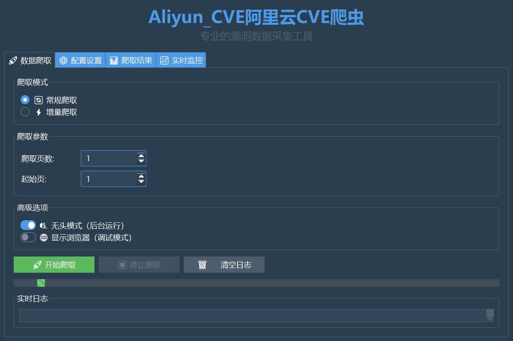

# GUI使用指南

## 概述

AliyunCVE_Crawler提供了一个基于ttkbootstrap的现代化图形用户界面，让用户可以通过直观的界面操作爬虫，无需编写代码。

## 🚀 快速启动

### 方法一：使用启动器（推荐）

```bash
python run_gui.py
```

启动器会自动检查和安装依赖，然后启动GUI界面。

### 方法二：直接启动

```bash
# 确保已安装GUI依赖
pip install ttkbootstrap pillow

# 启动GUI
python gui.py
```

## 🎨 界面概览



GUI界面采用现代化的设计，包含以下主要部分：

- **标题栏**：显示应用名称和版本信息
- **标签页**：四个主要功能模块
- **状态栏**：显示当前状态和时间

### 界面特色

- **现代化设计**：采用ttkbootstrap的"superhero"主题，提供深色现代界面
- **清晰的数据展示**：CVE列表使用不同颜色区分严重性等级
- **实时统计**：顶部显示CVE数量统计和平均CVSS评分
- **直观操作**：所有功能都可通过点击完成，无需命令行操作

## 📋 功能模块

### 1. 🚀 数据爬取

这是主要的爬取功能页面，包含：

#### 爬取模式选择
- **🔄 常规爬取**：按页数爬取CVE数据
- **⚡ 增量爬取**：爬取指定天数内的新CVE

#### 爬取参数设置

**常规爬取参数：**
- **爬取页数**：设置要爬取的页面数量（1-100）
- **起始页**：设置从第几页开始爬取（默认第1页）

**增量爬取参数：**
- **爬取天数**：设置爬取最近几天的数据（1-30天）

#### 高级选项
- **🔇 无头模式**：后台运行，不显示浏览器界面（推荐）
- **🌐 显示浏览器**：显示浏览器界面，用于调试

#### 控制按钮
- **🚀 开始爬取**：启动爬取任务
- **⏹️ 停止爬取**：停止当前爬取任务
- **🗑️ 清空日志**：清空日志显示区域

#### 实时日志
显示爬取过程中的详细日志信息，包括：
- 爬取进度
- 发现的CVE数量
- 错误信息
- 完成状态

### 2. ⚙️ 配置设置

配置爬虫的各种参数：

#### 基本配置
- **页面超时(秒)**：设置页面加载的超时时间
- **请求延迟(秒)**：设置请求之间的延迟范围，避免被限制
- **数据目录**：设置爬取数据的存储目录

#### 高级配置
- **User-Agent**：设置浏览器标识字符串
- **缓存TTL(秒)**：设置缓存的生存时间

#### 配置管理
- **💾 保存配置**：保存当前配置到文件
- **📂 加载配置**：从文件加载配置
- **🔄 重置配置**：重置为默认配置
- **📋 导出配置**：导出配置为JSON文件

### 3. 📊 爬取结果

查看和管理爬取结果：

#### 统计信息
显示爬取结果的统计数据：
- **总CVE数**：爬取到的CVE总数
- **严重/高危/中危/低危**：按严重性分类的数量
- **平均CVSS**：所有CVE的平均CVSS分数

#### CVE列表
以表格形式显示所有CVE信息：
- **CVE ID**：CVE编号
- **严重性**：漏洞严重程度
- **CVSS**：CVSS评分
- **发布日期**：漏洞发布日期
- **描述**：漏洞描述（截取前100字符）

#### 结果操作
- **📄 导出CSV**：将结果导出为CSV文件
- **📋 导出JSON**：将结果导出为JSON文件
- **🔍 查看详情**：查看选中CVE的详细信息
- **🗑️ 清空结果**：清空所有爬取结果

### 4. 📈 实时监控

监控功能模块（预留功能）：

#### 监控状态
- 显示当前监控服务的运行状态
- 🟢 监控运行中 / 🔴 监控未启动

#### 监控控制
- **🚀 启动监控**：启动持续监控服务
- **⏹️ 停止监控**：停止监控服务

#### 监控日志
显示监控过程中的日志信息

## 🎯 使用流程

### 基本爬取流程

1. **启动应用**
   ```bash
   python run_gui.py
   ```

2. **配置参数**
   - 切换到"⚙️ 配置设置"标签页
   - 根据需要调整爬取参数
   - 点击"💾 保存配置"保存设置

3. **开始爬取**
   - 切换到"🚀 数据爬取"标签页
   - 选择爬取模式（常规或增量）
   - 设置爬取参数
   - 点击"🚀 开始爬取"

4. **查看结果**
   - 爬取完成后自动切换到"📊 爬取结果"标签页
   - 查看统计信息和CVE列表
   - 可以导出结果或查看详情

### 高级使用技巧

#### 1. 批量爬取策略
- 对于大量数据，建议分批爬取
- 设置较大的请求延迟避免被限制
- 使用无头模式提高效率

#### 2. 增量更新
- 定期使用增量爬取获取新数据
- 设置合适的天数范围
- 结合监控功能实现自动化

#### 3. 配置优化
- 根据网络情况调整超时时间
- 设置合理的延迟范围（建议2-5秒）
- 选择合适的数据存储目录

#### 4. 结果管理
- 及时导出重要数据
- 定期清理旧的爬取结果
- 使用CSV格式便于Excel处理

## 🔧 故障排除

### 常见问题

#### 1. 启动失败
**问题**：GUI无法启动
**解决方案**：
```bash
# 检查依赖
pip install ttkbootstrap pillow

# 重新安装Playwright
playwright install chromium
```

#### 2. 爬取失败
**问题**：爬取过程中出现错误
**解决方案**：
- 检查网络连接
- 增加超时时间
- 调整请求延迟
- 查看详细日志信息

#### 3. 浏览器启动失败
**问题**：Playwright浏览器无法启动
**解决方案**：
```bash
# 重新安装浏览器
playwright install chromium

# 或安装所有浏览器
playwright install
```

#### 4. 配置加载失败
**问题**：配置文件无法加载
**解决方案**：
- 检查配置文件格式是否正确
- 使用"🔄 重置配置"恢复默认设置
- 手动删除损坏的配置文件

### 性能优化

#### 1. 内存使用
- 及时清空不需要的结果
- 分批处理大量数据
- 关闭不必要的标签页

#### 2. 网络优化
- 使用稳定的网络连接
- 设置合理的超时时间
- 避免并发过多请求

#### 3. 存储优化
- 定期清理数据目录
- 选择SSD存储提高性能
- 及时导出重要数据

## 📝 配置文件

### GUI配置文件 (gui_config.json)
```json
{
  "timeout": 30,
  "delay_min": 1,
  "delay_max": 3,
  "data_dir": "./data/aliyun_cve",
  "user_agent": "Mozilla/5.0...",
  "cache_ttl": 86400
}
```

### 项目配置文件 (config.json)
```json
{
  "crawler": {
    "max_pages": 50,
    "delay_range": [2, 5],
    "timeout": 60,
    "headless": true,
    "data_dir": "./data/aliyun_cve"
  }
}
```

## 🎨 主题和外观

GUI使用ttkbootstrap的"superhero"主题，提供：
- 现代化的深色界面
- 清晰的颜色区分
- 响应式布局设计
- 专业的图标和按钮

### 颜色说明

**CVE严重性等级颜色：**
- **红色背景**：严重(CRITICAL)漏洞 - 需要立即处理
- **橙色背景**：高危(HIGH)漏洞 - 优先处理
- **蓝色背景**：中危(MEDIUM)漏洞 - 及时处理
- **绿色背景**：低危(LOW)漏洞 - 定期处理

**界面状态颜色：**
- **绿色**：成功状态、正常操作
- **蓝色**：主要功能、信息提示
- **橙色**：警告状态、需要注意
- **红色**：错误状态、危险操作

**注意**：所有文本均使用黑色字体，确保在各种背景下都有良好的可读性。

## 🔮 未来功能

计划中的功能改进：
- 实时监控和自动爬取
- 邮件通知功能
- 数据可视化图表
- 多线程并发爬取
- 云端数据同步
- 插件系统支持

## 💡 使用建议

1. **首次使用**：建议先进行小规模测试（1-3页）
2. **生产使用**：设置合理的延迟和超时参数
3. **数据备份**：定期导出重要的爬取结果
4. **监控日志**：关注日志信息及时发现问题
5. **配置管理**：保存常用的配置设置

通过这个现代化的GUI界面，您可以轻松地管理和操作AliyunCVE_Crawler，无需复杂的命令行操作，大大提高了使用效率和用户体验。
